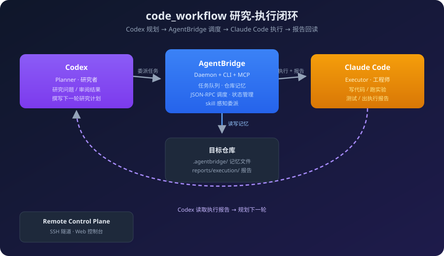

# code_workflow

`code_workflow` is a local research-and-execution loop for using Codex as the planner and Claude Code as the executor.

<p align="center">
  
</p>

It is designed for workflows like:

1. Codex studies a problem, reviews results, and writes the next research plan.
2. Codex dispatches concrete implementation or experiment tasks through AgentBridge.
3. Claude Code writes code, runs experiments, monitors execution, tests changes, and produces execution reports.
4. Codex reads those reports and plans the next cycle.

## Current status

This repository is usable now on `main` for a single-project or multi-project local loop with:

- one AgentBridge daemon,
- one managed Claude worker,
- task queueing,
- repository memory files,
- standard execution reports,
- Codex-to-Claude task delegation through a CLI or JSON-RPC.

It is best thought of as a practical research toolchain, not a polished production platform.

## Repository layout

- [agentbridge](./agentbridge): the runnable daemon, worker, and CLI
- [docs](./docs): usage docs and templates
- [codex-claude-bridge](./codex-claude-bridge): reusable skill definition
- [remote-control-plane](./remote-control-plane): SSH tunnel + web control console

## Quick start

Install dependencies:

```powershell
cd agentbridge
npm install
```

Run the smoke test:

```powershell
npm run smoke
```

Start the daemon and managed Claude worker:

```powershell
npm run stack
```

Initialize a target repo for the research loop:

```powershell
npm run init-loop -- D:\learning\github\my-research-repo
```

Delegate a task:

```powershell
node scripts/delegate-task.js @..\docs\templates\experiment-task.example.json
```

## CLI mode

This project can also be used as a single CLI command, similar to tools like OpenSpec.

From [agentbridge](./agentbridge):

```powershell
npm link
```

Then you can use:

```powershell
code-workflow stack
code-workflow init-loop D:\learning\github\my-research-repo
code-workflow delegate @task.json
code-workflow rpc worker_status
```

The CLI entrypoint lives at [cli.js](./agentbridge/src/cli.js).

## Closed loop structure

Each project initialized through `init-loop` gets:

- `.agentbridge/project-memory.md`
- `.agentbridge/current-task.md`
- `.agentbridge/task-history.md`
- `.agentbridge/planner-inbox.md`
- `.agentbridge/research-plan.md`
- `reports/execution/`

Suggested loop:

1. Codex reads `.agentbridge/planner-inbox.md`, `.agentbridge/research-plan.md`, and the latest file in `reports/execution/`.
2. Codex decides the next experiment or code change.
3. Codex delegates the task through AgentBridge.
4. Claude Code executes it and writes the execution report.
5. Codex reads the report and plans the next step.

## Skill-aware delegation

If you want Claude Code to obey your own runbooks or coding skills, add them through `metadata.skillFiles` in the task payload. The worker will force Claude to read those files before changing code.

See:

- [docs/templates/experiment-task.example.json](./docs/templates/experiment-task.example.json)
- [docs/templates/research-plan.example.md](./docs/templates/research-plan.example.md)
- [docs/codex-claude-agentbridge-workflow.md](./docs/codex-claude-agentbridge-workflow.md)
